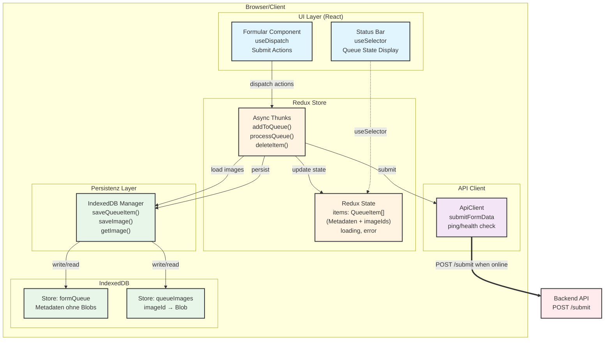

# Offline Queue POC - Spezifikation

## Projektziel

Entwicklung eines Proof of Concept für eine Offline-Queue, die Formulardaten (Text + Bilder) lokal speichert und bei bestehender Internetverbindung automatisch an einen Server sendet.

---

## 1. Technologie-Stack

### Frontend

- **Framework**: Vite + React
- **State Management**: Redux Toolkit
- **Form Handling**: React State Management
- **UI**: React Components mit CSS
- **Browser-Datenbank**: IndexedDB via `idb` Package (Persistenz-Layer)
- **Queue Processing**: React-basiert im Main-Thread mit Redux Thunks

### Backend (Mock)

- **Mock-Server**: Express.js mit Multer

**Wichtig**: json-server kann kein FormData mit Bildern verarbeiten, daher nutzen wir Express mit Multer.

### NPM Packages

```json
{
  "react": "^19.1.0",
  "react-dom": "^19.1.0",
  "@reduxjs/toolkit": "^2.x",        // Redux State Management
  "react-redux": "^9.x",             // React Bindings für Redux
  "idb": "^8.0.0",                   // IndexedDB Wrapper (Persistenz)
  "express": "^4.18.0",              // Mock API Server
  "multer": "^1.4.5",                // FormData/File Upload Handling
  "cors": "^2.8.5"                   // CORS Middleware
}
```

---

## 2. Architektur-Übersicht



---

## 3. State & Datenbank-Schema

### Redux State (Memory - Source of Truth für UI)

```typescript
interface QueueState {
  items: QueueItem[];
  loading: boolean;
  error: string | null;
  processingItemId: string | null;
}

interface QueueItem {
  id: string;              // UUID v4
  timestamp: number;       // Date.now()
  status: 'pending' | 'sending' | 'sent' | 'error';
  retryCount: number;      // Anzahl Wiederholungsversuche
  data: {
    textField1: string;
    textField2: string;
    // ... weitere Textfelder
  };
  imageIds: string[];      // ⚠️ Nur Referenzen, keine Blobs!
  error?: string;          // Fehlermeldung bei gescheiterten Versuchen
}
```

### IndexedDB Schema (Persistenz)

**Object Store 1: `formQueue`** (Metadaten)
```typescript
{
  id: string;
  timestamp: number;
  status: 'pending' | 'sending' | 'sent' | 'error';
  retryCount: number;
  data: FormData;
  imageIds: string[];      // Referenzen zu queueImages
  error?: string;
}
```

**Indices:**
- `status`: Für schnelle Abfrage nach Status
- `timestamp`: Für chronologische Sortierung

**Object Store 2: `queueImages`** (Blobs)
```typescript
{
  imageId: string;         // UUID (Primary Key)
  blob: Blob;             // Bild-Daten
  fileName: string;
  mimeType: string;
  uploadedAt: number;
}
```

**Warum getrennt?**
- Redux State bleibt serializable
- Blobs werden nur bei Bedarf geladen (Performance)
- Kleinere Memory-Footprint

---

## 4. Komponenten-Beschreibung

### 4.1 Formular (UI)

**Datei**: `src/components/FormComponent.js`

**Features**:

- Eingabefelder für Text (z.B. Name, Beschreibung)
- File-Input für Bilder (multiple)
- Submit-Button
- Status-Anzeige (Online/Offline)
- Queue-Counter (Anzahl ausstehender Einträge)
- Vorschau hochgeladener Bilder

**Validierung**:

- Pflichtfelder prüfen
- Bildgröße limitieren (z.B. max 5MB pro Bild)
- Erlaubte Bildformate: JPG, PNG, WebP

---

### 4.2 Redux Queue Slice

**Datei**: `src/store/queueSlice.ts`

**Async Thunks**:

```typescript
// Queue beim App-Start laden
initQueue(): AsyncThunk

// Neues Item zur Queue hinzufügen
addToQueue({ data, images }): AsyncThunk

// Alle pending Items verarbeiten
processQueue(): AsyncThunk

// Einzelnes Item löschen
deleteItem(id): AsyncThunk

// Item-Status aktualisieren
updateItemStatus(id, status): AsyncThunk
```

**Selectors**:

```typescript
selectAllItems(state): QueueItem[]
selectPendingItems(state): QueueItem[]
selectQueueSize(state): number
selectIsLoading(state): boolean
```

**Usage in Components**:

```typescript
// Dispatch Actions
const dispatch = useDispatch();
dispatch(addToQueue({ data, images }));

// Read State
const queueSize = useSelector(selectQueueSize);
```

---

### 4.3 IndexedDB Manager

**Datei**: `src/services/IndexedDBManager.ts`

**Methoden** (Low-Level Persistenz):

```typescript
class IndexedDBManager {
  // Queue Items (Metadaten)
  async saveQueueItem(item: QueueItem): Promise<void>
  async getQueueItem(id: string): Promise<QueueItem>
  async getAllQueueItems(): Promise<QueueItem[]>
  async deleteQueueItem(id: string): Promise<void>
  
  // Images (Blobs)
  async saveImage(blob: Blob, fileName: string, mimeType: string): Promise<string>
  async getImage(imageId: string): Promise<ImageData>
  async deleteImage(imageId: string): Promise<void>
}
```

**Wichtig**: Wird nicht direkt von Komponenten aufgerufen, nur von Redux Thunks!

---

### 4.4 App Logic (Queue Processing)

**Datei**: `src/App.jsx`

**Verantwortlichkeiten**:

1. **Online/Offline Detection**
   - `window.addEventListener('online')` Event Listener
   - `navigator.onLine` Status-Prüfung

2. **Queue Processing**
   - Bei Online-Status: Pending Items verarbeiten
   - Retry-Logik bei Fehlern (max. 3 Versuche)
   - Automatisches Retry-Intervall (alle 30 Sekunden)

3. **Trigger-Punkte**
   - Nach Form-Submit (wenn online)
   - Bei "online" Event (Verbindung wiederhergestellt)
   - Periodisches Polling (30s Intervall)
   - Beim App-Start (wenn online und Queue nicht leer)

**Implementation**:

```javascript
useEffect(() => {
  // Initialize IndexedDB and process queue
  const initAndProcess = async () => {
    await queueManager.init();
    if (navigator.onLine) {
      await processQueue();
    }
  };

  initAndProcess();

  // Process queue when coming online
  const handleOnline = async () => {
    console.log('🌐 Connection restored - processing queue...');
    await processQueue();
  };

  window.addEventListener('online', handleOnline);

  // Set up interval to retry pending items every 30 seconds
  const retryInterval = setInterval(() => {
    if (navigator.onLine) {
      processQueue();
    }
  }, 30000);

  return () => {
    window.removeEventListener('online', handleOnline);
    clearInterval(retryInterval);
  };
}, [processQueue]);
```

**Wichtig**: Kein Service Worker - Queue Processing läuft nur bei geöffneter App im Browser.

---

### 4.5 API Client

**Datei**: `src/services/ApiClient.js`

**Methode**:

```javascript
async function submitFormData(queueItem) {
  const formData = new FormData();
  
  // Text-Daten hinzufügen
  Object.entries(queueItem.data).forEach(([key, value]) => {
    formData.append(key, value);
  });
  
  // Bilder hinzufügen
  queueItem.images.forEach((image, index) => {
    formData.append(`image_${index}`, image.blob, image.fileName);
  });
  
  const response = await fetch('/api/submit', {
    method: 'POST',
    body: formData
  });
  
  if (!response.ok) {
    throw new Error(`HTTP ${response.status}`);
  }
  
  return await response.json();
}
```

---

## 5. Workflow / User Flow

### Konzept: Alle Requests über Queue

**Wichtig**: Alle Form-Submissions laufen IMMER über die Queue - unabhängig vom Online-Status.

```
User Submit → Queue (IndexedDB) → Queue Processor → API
                 ↓
          Immer gespeichert
                 ↓
          Verarbeitung wenn online
```

### Vorteile

- ✅ Konsistente Logik (kein Unterschied zwischen online/offline)
- ✅ Robustheit (auch bei instabiler Verbindung keine Datenverluste)
- ✅ Retry-Mechanismus funktioniert für alle Requests
- ✅ Persistenz (Browser-Refresh verliert keine Daten)

### Szenario 1: Online-Submission

1. User füllt Formular aus
2. User klickt "Submit"
3. **Daten werden zur Queue hinzugefügt** (Status: `pending`)
4. Queue-Processor wird sofort aufgerufen
5. Prüft: `navigator.onLine` = true
6. Daten werden an Server gesendet
7. Bei Erfolg: Eintrag aus Queue entfernen
8. User erhält Erfolgsmeldung

### Szenario 2: Offline-Submission

1. User füllt Formular aus (Offline)
2. User klickt "Submit"
3. **Daten werden in Queue gespeichert** (Status: `pending`)
4. Queue-Processor wird aufgerufen
5. Prüft: `navigator.onLine` = false
6. Überspringt Verarbeitung mit Log: "🔴 Offline - Queue processing skipped"
7. User sieht "📦 In Queue gespeichert" Meldung
8. User kann weitere Formulare ausfüllen (alle landen in Queue)
9. Verbindung wird wiederhergestellt
10. Online-Event triggert Queue-Processing
11. Automatische Verarbeitung aller pending Items
12. User erhält Notifications über erfolgreiche Übermittlung

---

## 6. Error Handling & Retry-Strategie

### Queue Processing Flow

```javascript
async function processQueue() {
  // Nur verarbeiten wenn online
  if (!navigator.onLine) {
    console.log('🔴 Offline - Queue processing skipped');
    return;
  }

  const pendingItems = await queueManager.getPendingItems();
  
  for (const item of pendingItems) {
    try {
      await queueManager.updateStatus(item.id, 'sending');
      await apiClient.submitFormData(item);
      await queueManager.updateStatus(item.id, 'sent');
      await queueManager.removeFromQueue(item.id);
      // Success notification
    } catch (error) {
      const retryCount = await queueManager.incrementRetryCount(item.id);
      
      if (retryCount >= 3) {
        await queueManager.updateStatus(item.id, 'error', error.message);
        // Error notification
      } else {
        await queueManager.updateStatus(item.id, 'pending');
        // Will retry on next trigger
      }
    }
  }
}
```

### Trigger-Punkte für Queue-Processing

1. **Nach jedem Form-Submit** (sofort, wenn online)
2. **Online-Event** (window.addEventListener('online'))
3. **App-Start** (beim Laden, falls online und Queue nicht leer)
4. **Polling-Intervall** (alle 30 Sekunden, wenn online)

### Retry-Logik

```javascript
const MAX_RETRIES = 3;
const RETRY_DELAYS = [1000, 5000, 15000]; // 1s, 5s, 15s

async function processQueueItem(item) {
  try {
    await submitFormData(item);
    await updateStatus(item.id, 'sent');
  } catch (error) {
    if (item.retryCount < MAX_RETRIES) {
      await updateRetryCount(item.id, item.retryCount + 1);
      const delay = RETRY_DELAYS[item.retryCount];
      setTimeout(() => processQueueItem(item), delay);
    } else {
      await updateStatus(item.id, 'error');
      await saveError(item.id, error.message);
    }
  }
}
```

### Error-Kategorien

- **Network Error**: Retry
- **4xx Client Error**: Nicht retryen, als Error markieren
- **5xx Server Error**: Retry mit Backoff
- **Timeout**: Retry

---

## 7. UI/UX Überlegungen

### Status-Indikator

```
┌─────────────────────────────┐
│ ● Online  │  Queue: 3 Items │
└─────────────────────────────┘
```

### Queue-Übersicht (Optional)

Eine Liste mit ausstehenden Einträgen:

- Timestamp
- Status
- Retry-Count
- Fehlermeldung (falls vorhanden)
- Manueller "Retry" Button

### Notifications

- Browser-Notifications bei erfolgreicher Übermittlung
- Toast-Messages für User-Feedback

---

## 8. Sicherheitsüberlegungen

1. **Datenbereinigung**: Erfolgreich gesendete Items nach X Tagen löschen
2. **Quota Management**: IndexedDB Storage-Limits beachten
3. **Sensitive Daten**: HTTPS erforderlich für Service Worker
4. **XSS**: User-Input sanitizen vor Anzeige

---

## 9. Testing-Strategie

> **TODO**: Wird noch definiert

---

---

## 9. Testing-Strategie

> **TODO**: Wird noch definiert

---

## 10. Implementierungs-Schritte

### Phase 1: Basis-Setup

- [ ] Vite-Projekt erstellen
- [ ] Grundlegendes HTML-Formular
- [ ] IndexedDB Setup mit `idb` Package

### Phase 2: Queue Manager

- [ ] QueueManager-Klasse implementieren
- [ ] CRUD-Operationen für Queue-Items
- [ ] Unit Tests

### Phase 3: App Logic & Queue Processing

- [x] Online/Offline Detection (window events)
- [x] Queue Processing im React useEffect
- [x] Retry-Intervall implementieren

### Phase 4: Integration

- [ ] Formular mit Queue Manager verbinden
- [ ] API Client implementieren
- [ ] Mock-Server für Tests

### Phase 5: Polish

- [ ] UI-Verbesserungen
- [ ] Error Handling verfeinern
- [ ] Notifications implementieren
- [ ] Performance-Optimierung

---

## 11. Technische Entscheidungen ✅

1. **Backend**: ✅ JSON-Server (npm package) für Mock-API
   - Schnelles Setup, perfekt für POC
   - Automatisches REST-API aus JSON-Datei

2. **Framework**: ✅ React + react-hook-form
   - Strukturierte Komponenten-Architektur
   - react-hook-form für optimales Formular-Handling
   - Vite als Build-Tool

3. **Bildkompression**: ✅ Keine Kompression
   - Originalbilder speichern
   - Reduziert Komplexität im POC
   - Kann später bei Bedarf ergänzt werden

4. **Priorisierung**: ✅ FIFO (First In, First Out)
   - Einfache chronologische Verarbeitung nach Timestamp
   - Ausreichend für POC
   - Erweiterbar falls nötig

5. **Batch-Upload**: ✅ Einzeln (1 Item pro Request)
   - Besseres Fehler-Handling
   - Granulares Status-Update pro Item
   - Klarere User-Experience

6. **State Management**: ✅ Redux Toolkit
   - Konsistent mit bestehender App-Architektur
   - Redux als UI State Source of Truth
   - IndexedDB als Persistenz-Layer (nur für Metadaten + Blobs)
   - Keine Blobs im Redux State (serializable!)
   - Redux DevTools für Debugging

7. **Queue Processing**: ✅ Nur bei offenem Browser (kein Service Worker)
   - Online/Offline Event Listener in React App
   - Polling-Intervall für automatische Retries
   - Funktioniert in allen Browsern
   - Einfacher zu implementieren & debuggen
   - Keine Background Sync API (komplexer, nicht überall unterstützt)
   - **Trade-off**: Queue wird nur verarbeitet wenn App offen ist

8. **Blob-Speicherung**: ✅ Separate IndexedDB Store
   - Blobs getrennt von Metadaten
   - Lazy Loading bei Bedarf
   - Kleinere Redux State-Größe
   - Custom Hook `useQueueImages()` für Image Loading

---

## 12. Weitere Optimierungen (Nice-to-Have)

- **Image Compression**: z.B. mit `browser-image-compression`
- **Progress Indication**: Upload-Progress für große Dateien
- **Conflict Resolution**: Was wenn gleiche Daten mehrfach submitted werden?
- **Queue Prioritization**: Wichtige Items zuerst verarbeiten
- **Partial Uploads**: Große Dateien in Chunks hochladen
- **IndexedDB Migrations**: Schema-Versionierung

---

## Migrations-Plan

Die detaillierte Migrations-Planung zur Redux-Integration findest du in:
**[REDUX-MIGRATION-PLAN.md](./REDUX-MIGRATION-PLAN.md)**

---

## Nächste Schritte

1. Review der Redux-Architektur
2. Start mit Phase 1: Redux Toolkit Installation
3. Schrittweise Migration gemäß Plan
4. Testing nach jeder Phase
